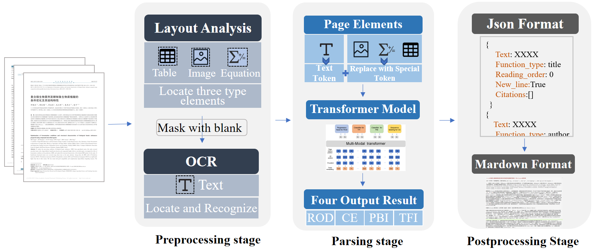

# CH-SciPDF-Parse

This repo contain the code for Chinese Journal PDF parsing method.

**Motivation**: 
1. General PDF parsing method cannot meet the requirements of academic PDF parsing
2. GROBID get poor performance on Chinese journal PDFs

**How it Works**

**Advantage**
1. High accuracy of text type identification(especially for the table caption and image caption)
2. citation extraction
3. More formatted Output
